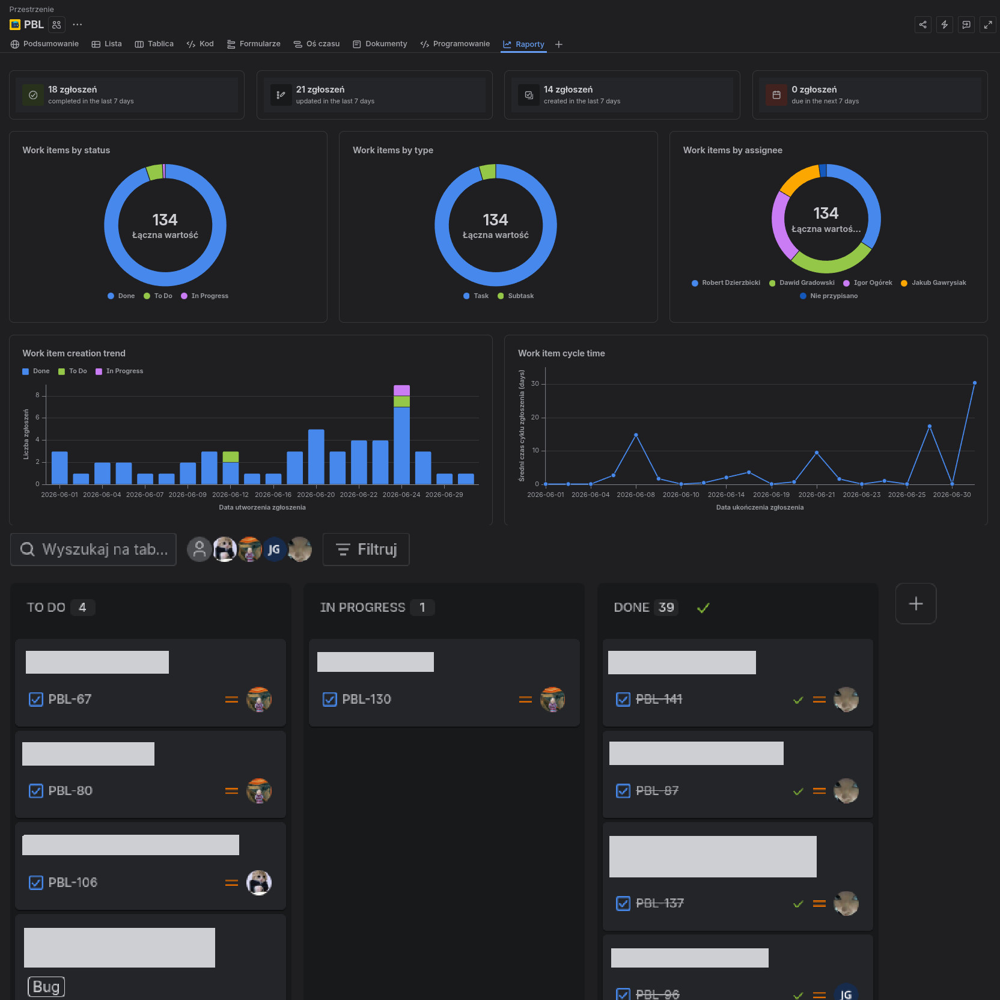

# Out of Tune (Game) & NFSEngine (Custom C++ Engine)

A dynamic, sound-based 3D platformer where music is a time machine. Built entirely from scratch on our custom C++ framework (**NFSEngine**) using OpenGL.
Created as a 6th-semester student project at Lodz University of Technology by a team of 4 Programmers and 2 Artists.

## 🏆 Awards & Achievements

**AMD Special Award at ZTGK:** We showcased our game and engine at the _ZTGK_ (students game festival) organized by the Lodz University of Technology and proudly received a **Special Award from AMD**, the technology sponsor of the event.

## 🎮 Project Features

- **Rhythm-Driven Gameplay:** Obstacles pulse, move, and activate to the beat of the music.
- **Aura Shifting (Track Switching):** Change active soundtracks on the fly to manipulate level architecture and movement mechanics.
- **Custom-Built Engine (NFSEngine):** Fully customized architecture separating core engine systems from gameplay logic.
- **Unity as a Level Editor:** We utilized Unity strictly as a scene editor, developing custom scripts to export scenes and object data into `.json` formats parsable by our engine.
- **Advanced Audio & Video Integration:** Implemented own audio engine and real-time video decoding.

## 🛠️ Technologies & Libraries

- **Core & Graphics:** `C++17`, `OpenGL`, `glad`, `glm`
- **Audio & Video:** `miniaudio`, `pl_mpeg`, `stb_vorbis`
- **Assets & Data:** `assimp` (model and animations loading), `stb_image`, `stb_truetype`, `nlohmann/json`
- **Utilities:** `spdlog` (logging), `ImGUI` (for debugging purposes), , `clang-format` nad `clang-tidy`

## 🎥 Gameplay & Visuals


---

## 🕹️ How to build and run (Windows)

We use CMake for build automation. To compile the project locally:

1. Clone the repository:
   `git clone https://github.com/NowyFolderStudio/PBL_ZTGK.git`
2. Open your terminal in the cloned directory and run:
   - `cmake -S . -B ./build`
   - `cmake --build ./build --config Release`
3. The executable will be generated in the `./build/Release/` directory.

### 📥 2nd Option: Download Release

You can download the compiled `.exe` version directly from the ["Out of Tune" itch.io page](https://nowyfolderstudio.itch.io/out-of-tune).

---

## 📂 Project Structure

```text
OutOfTuneProject/
├── Game/                   # Game-specific logic and assets
│   ├── assets/             # Models, textures, audio files
│   ├── include/            # Game headers (Components, Layers, SceneLoader)
│   └── src/                # Game source files
├── NFSEngine/              # Custom C++ Engine Subproject
│   ├── include/            # Engine headers
│   ├── src/                # Engine source files
│   │   ├── Core/           # Core architecture of the engine (audio, physics, app, etc.)
│   │   ├── Platforms/      # Desktop windowing, OpenGL context
│   │   ├── Renderer/       # OpenGL wrappers, shaders, rendering pipeline
│   │   ├── UI/ & ImGui/    # User Interface and developer tools
│   │   └── ...             # Components, Debugging, Events, SceneLoader
│   └── thirdparty/         # External libraries (assimp, glad, glm, miniaudio, etc.)
└── Tools/                  # External tools
```

---

## 📊 Project Management & Workflow

This project was developed by a 6-person team (4 Programmers, 2 Artists) over the course of a single academic semester. To ensure smooth collaboration and meet deadlines, we utilized:

- **Jira & Kanban Methodology:** All tasks were tracked, estimated, and moved through a structured Kanban board.
- **Agile Approach:** Regular syncs to review progress and adapt to challenges.
- **Code Quality Assurance:** We strictly utilized clang-format to maintain a unified code style across the entire team and clang-tidy for static code analysis to catch potential bugs, memory issues, and enforce modern C++ best practices.

  

---

## 🛠️ Technical Highlights (Under the Hood)

Building a custom engine was a massive learning experience. Here are some architectural highlights we are the most proud of:

- **Engine/Game Separation:** NFSEngine can be compiled as a static library and reused for future projects.
- **Data-Driven Levels:** By utilizing Unity for scene composition and writing a custom JSON exporter, we decoupled level design from hardcoding, allowing our artists to iterate rapidly.
- **Memory Management:** Extensive use of smart pointers and RAII to prevent memory leaks in the engine's core.
- **Design Patterns:** Applied structural patterns like Singleton (for managers), Factory, and Component-based architecture for game objects.

## 🤝 Acknowledgments

A special thank you to our instructors and supervisors at the Lodz University of Technology for their guidance, valuable feedback, and support throughout the semester. This project was a phenomenal opportunity to put our academic knowledge into real-world practice and dive deep into low-level C++ engine architecture under expert mentorship!
